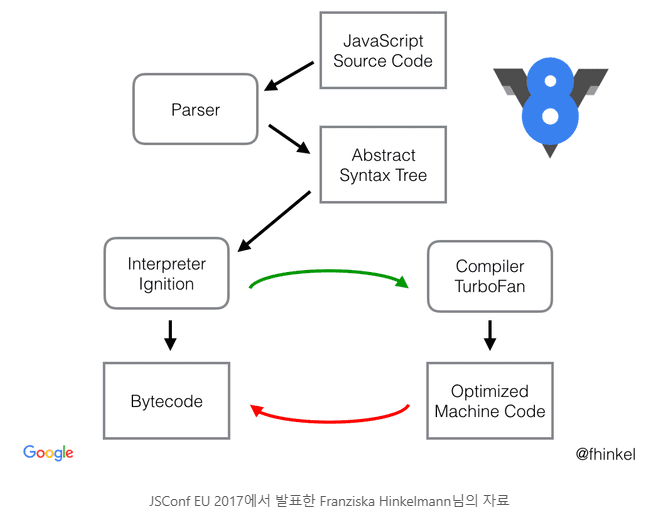

# V8 엔진과 크롬 브라우저

구글의 크롬 브라우저는 자바스크립트 해석기인 `V8`엔진을 발표하면서 성능이 크게 개선이 되었다.

이로 인하여 자바스크립트를 통하여 복잡한 UI의 동작을 자바스크립트로 처리가 가능하게 되고, 최근에는 SPA등 사용자 UI를 개선하기 위한 다양한 프론트 개발 플렛폼이 등장하게 된다.


## 자바스크립트 엔진

자바스크립트는 브라우저에서  해석하고 실행할 수 있는 인터프리터 언어 입니다. 브라우저는 이러한 자바스크립트 엔진을 탑제하고 동작을 합니다.  이 엔진은 브라우저 마다 다양한 종류의 엔진이 존재합니다.

* Microsoft Edge : Chakra 엔진
* 구글 크롬 : V8 엔진

> 최근에는 Microsoft도 Chromium 오픈소스 프로젝트에 동참하면서 `V8`로 엔진을 변경했다.


## V8 엔진의 동작

구글의 `V8`엔진은 어떻게 자바스크립트 언어를 해석할까? V8 엔진은 빠른 성능을 처리하기 위하여 `C++`언어로 개발이 되었습니다. 구글은 V8엔진을 오픈소스로 공개함으로서 개발자 커뮤니티의 도움을 받아 지속적으로 성장을 하고 있다. [V8엔진 깃허브 저장소](https://github.com/v8/v8)


 V8엔진은 대표적으로 구글에서 개발한 크롬(Chrome) 브라우저와 Node 에 적용되어 있습니다. 또한 ES2016+(ES7+)이상의 자바스크립트 문법을 지원합니다. V8엔진이 도입된 것은 https://kangax.github.io/compat-table/es2016plus/ 에서 보다 자세히 확인할 수 있습니다.


## V8 작동원리

로우레벨(Low level)상에서 V8엔진의 작동원리에 대해서 간략히 살펴봅니다. V8 자바스크립트 해석기의 엔진 원리를 한번 살펴 보는 것은, 자바스크립트의 동작을 보다 상세하게 알기 위해서 이다. 이는 자비스크립트의 코드의 성능을 향상시키고, 최적의 성능을 발휘하기 위해서 이다.


V8의 자바스크립트 코드 해석 플로우




1. 파서(parser)

자바스크립트의 첫번째 단계는 소스코드를 읽어 파서(parser)에게 전달하는 것입니다. 파서는 소스 코드를 분석하여 추상구문트리(AST, Abstract Syntax Tree)를 생성한다.


2. Ignition

`Ignition`은 사전적 의미로 `점화기`를 말한다. V8엔진은 자동차의 8기통 엔진을 의미하는 형상으로, 엔진이 동작을 하기 위해서는 지속적으로 연로를 태워 기동을 해야 한다. 이때, 엔진을 태우기 위하여 불곷을 발생하는 것이 바로 점화기 이다. 여기서 연로는 우리가 작성한 자바스크립트 소스코드가 된다.


두번째 해석 단계는 추상구문트리를 Ignition 해석기를 통하여 바이트코드(Bytecode)로 변한합니다. 바이트코드는 사람이 작성한 텍스트 코드보다 컴퓨터 기계가 보다 편하게 해석하여 처리할 수 있는 코드이다. 또한, 인터프리터 언어는 코드를 해석하고 실행하기 위하여 몇번의 소스코드의 구조를 검사하게 되는데, 추상구문트리를 바이트 코드로 변경해 놓으면 보다 빠르게 코드 구조 검사를 할 수 있다.


3. TurboFan

우리가 작성한 소스 코드는 실제적으로 바이트 코드로 변환되어 실행이 된다.  컴퓨터가 순차적으로 많은 양의 바이트 코드를 실행하려면 자원을 많이 사용하게 된다. 또한, 많은 자원은 오랜 동작 시간과 과열을 발생하게 되는 요인이기도 하다.


바이트 코드 중에서 자주 반복되어 실행되어야 하는 부분은 TurboFan 이라는 영역으로 전달되어 보다 최적화 하여 동작을 할 수 있는  **Optimized Machine Code** 로 다시 컴파일 된다. 또한 반대로 사용빈도가 적으면 `Deoptimizing` 하기도 한다.


TurboFan은 과열된 바이트 코드의 동작을 식혀주는 역할을 자동차 엔진에서 따와서 명칭을 한것 같다.


## 파싱(Parsing), 코드의 의미 파악

컴파일러 및 인터프리터에서 파싱이란 소스코드를 추상구문트리로 변경을 하는 과정을 말합니다. 추상구문트리는 컴파일러등에서 주로 사용되는 자료 구조 입니다. 우리가 작성한 소스코드를 보다 컴퓨터가 쉽게 이해할 수 있도록 `구조화`하는 것을 말합니다.


파서는 우리가 알고있는 언어의 예약어, 표현식, 함수등을 해석하여 구조화 합니다. 따라서, 파서는 생각보다 복잡하고 많은 리소스를 소비하는 동작입니다.


## 점화(Ignition), 바이트 코드(Bytecode) 생성

`바이트 코드(Bytecode)`는 고급 언어로 작성된 소스 코드를 보다 빠르게 실행할 수 있도록 중간 코드로 한번 컴파일 한 코드를 말한다.  `V8`에서는 `Ignition`이 이 역할을 수행한다.


자바스크립트는 `동적 타이핑 언어`로서 소스 코드가 실행되기 전에 알 수 없는 다양한 값들이 존재한다. 이러한 점 때문에 인터프리터가 소스 코드를 최적화 하기 힘든 점이 있습니다. 이러한 코드 변환은 많은 메모리 리소스를 소비하게 됩니다.


V8의 새로운 Ignition은 한번에 추상구문트리를 컴파일 하는 거이 아니라 한줄 단위로 인터프리팅 하는 방법으로 개선된 동작을 수행합니다.


* 적은 메모리 사용 : 자바스크립트를 직접 기계어로 컴파일 하는 것보다, 중간 언어인 바이트코드로 컴파일 하여 메모리의 사용량을 감소 합니다.
* 파싱 오버헤드 감소 : 바이트 코드는 소스코드보다 간결하기 때문에 다시 파싱하기 편하다.
* 복잡성 감소 :  컴파일시 복잡한 파이프 라인을 감소합니다. `Optimizing`이든 `Deoptimizing`이든 바이트 코드 하나만 생각하면 되기 때문에 편하다.

 

## 바이트코드

V8 엔진을 기반으로 개발된 nodejs v8.3+ 이상을 사용한다면, 바이트 코드를 확인할 수 있습니다.

먼저 다음과 같은 자바스크립트 코드를 작성해 봅니다.


```javascript
function hello(name) {
  return 'Hello,' + name;
}
console.log(hello('Jiny'));
```


그리고 nodejs를 실행할때 `--print-bytecode` 옵션을 같이 입력합니다.


```
$ node --print-bytecode add.js
...
[generated bytecode for function: hello]
Parameter count 2
Frame size 8
   15 E> 0x2ac4000d47b2 @    0 : a0                StackCheck
   30 S> 0x2ac4000d47b3 @    1 : 12 00             LdaConstant [0]
         0x2ac4000d47b5 @    3 : 26 fb             Star r0
         0x2ac4000d47b7 @    5 : 25 02             Ldar a0
   46 E> 0x2ac4000d47b9 @    7 : 32 fb 00          Add r0, [0]
   53 S> 0x2ac4000d47bc @   10 : a4                Return
...
```


자바스크립는 자신의 객체에 접근할 수 있는 this를 가지고 있습니다. 우리가 작성한 예제 코드에는 매개변수가 하나만 존재합니다. 하지만, 바이트 코드는 암묵적으로 this를 포함한 파라미터 카운드가 2인것을 확인할 수 있습니다.


또한 바이트 코드는 CPU의 레지스터(register)를 통하여 계산을 처리하는 코드들로 변환됩니다.


1. `StackCheck`: 스택 포인터의 상한값을 확인한 것이다. 이때 스택이 임계 값을 넘어가면 `Stack Overflow`가 발생하기 때문에 함수 실행을 중단해버린다.
2. `LdaConstant [0]`: `Ld`는 `Load`의 약자이다. 말 그대로 어떠한 상수를 `누산기(Accumulator)`에 불러온 것이다. 이 상수는 `Hello,`이다.
3. `Star r0`: 누산기에 들어있는 값을 레지스터 `r0`번으로 이동시킨다. `r0`은 지역 변수를 위한 레지스터이다.
4. `Ldar a0`: 누산기에 레지스터 `a0`번에 있는 값을 담는다. 이 경우 `a0` 레지스터의 값은 인자 `name`이다.
5. `Add r0, [0]`: `r0`에 있는 `Hello,`와 `0`을 더하고 누산기에 저장한다. 이때 상수 `0`은 코드가 실행될 때 인자 `name`으로 매핑된다.
6. `Return`: 누산기에 있는 값을 반환한다.


이처럼 자바스크립트로 간단하게 작성한 함수들도 컴퓨터 내부적으로 실행하기 위해서는 여러 단계를 걸쳐서 동작을 하는 것을 볼 수 있습니다.


`바이트 코드`는 기계어 코드가 아니라  CPU 내의 레지스터와 누산기를 어떤 식으로 사용하라고 직접 명령하는 명령문과 같다.


`V8` 엔진은 우리가 작성한 자바스크립트 코드를 내부적으로는 이런 모습의 `바이트 코드`로 전부 변환해놓기 때문에 코드 라인이 처음 실행될 때는 조금 시간이 걸리겠지만 그 이후부터는 거의 어셈블리를 컴파일 하여 실행하는  성능을 보일 수 있다.


## TurboFan으로 뜨거워진 코드 식히기

`TurboFan`은 `V8`의 최적화를 담당하는 컴파일러이다.

`V8`은 런타임 중에 함수나 변수들의 호출 빈도와 같은 데이터를 모아 TurboFan에게 코드를 최적화 하는 것이다. 코드의 최적화는 히든 클래스(Hidden Class)`나 `인라인 캐싱(Inline Caching)등 다양한 기법들이 존재한다. 

* `히든 클래스`는 비슷한 놈들끼리 분류해놓고 가져다 쓰는 것
* `인라인 캐싱`은 자주 사용되는 코드가 같은 함수의 호출부라면 같이 함수의 내용으로 바꿔버리는 것이다. 말 그대로 `캐싱(Caching)`이다.


```javascript
function sample(a, b, c) {
  const d = c - 100;
  return a + d * b;
}

for (let i = 0; i < 100000; i++) {
  sample(i, 2, 100);
}
```


`NodeJS`를 실행할 때 `--trace-opt` 옵션을 주면 런타임 때 코드가 최적화되는 것을 확인해볼 수 있다.


```
$ node --trace-opt test.js

[marking 0x010e66b69c09 <JSFunction (sfi = 0x10eacdd4279)> for optimized recompilation, reason: small function, ICs with typeinfo: 3/3 (100%), generic ICs: 0/3 (0%)]
[marking 0x010e66b6a001 <JSFunction sample (sfi = 0x10eacdd4371)> for optimized recompilation, reason: small function, ICs with typeinfo: 3/3 (100%), generic ICs: 0/3 (0%)]
[compiling method 0x010e66b6a001 <JSFunction sample (sfi = 0x10eacdd4371)> using TurboFan]
[compiling method 0x010e66b69c09 <JSFunction (sfi = 0x10eacdd4279)> using TurboFan OSR]
[optimizing 0x010e66b69c09 <JSFunction (sfi = 0x10eacdd4279)> - took 0.132, 0.453, 0.027 ms]
[optimizing 0x010e66b6a001 <JSFunction sample (sfi = 0x10eacdd4371)> - took 0.850, 0.549, 0.012 ms]
[completed optimizing 0x010e66b6a001 <JSFunction sample (sfi = 0x10eacdd4371)>]
```


위의 코드는  `ICs with typeinfo: 3/3 (100%)`로  인라인 캐싱으로 처리했다.


